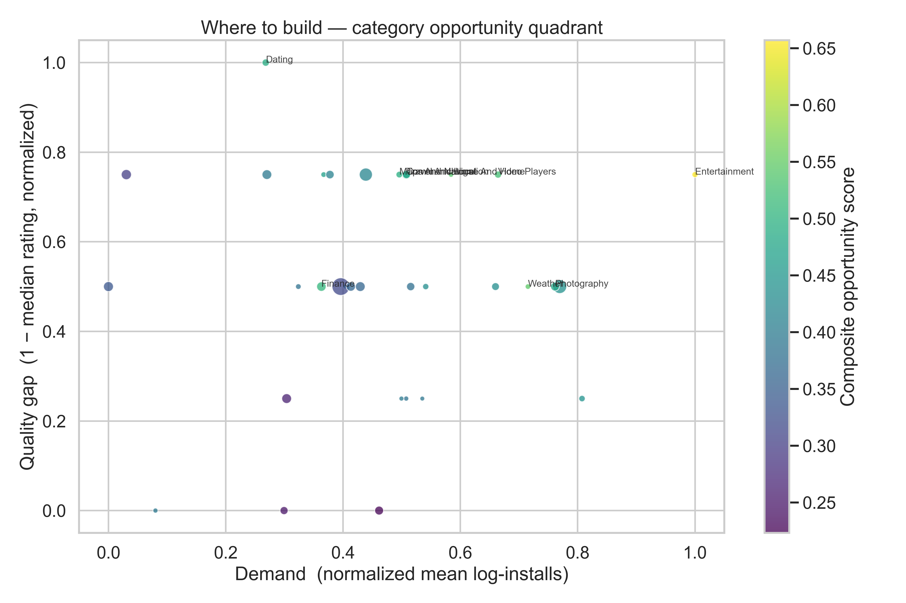
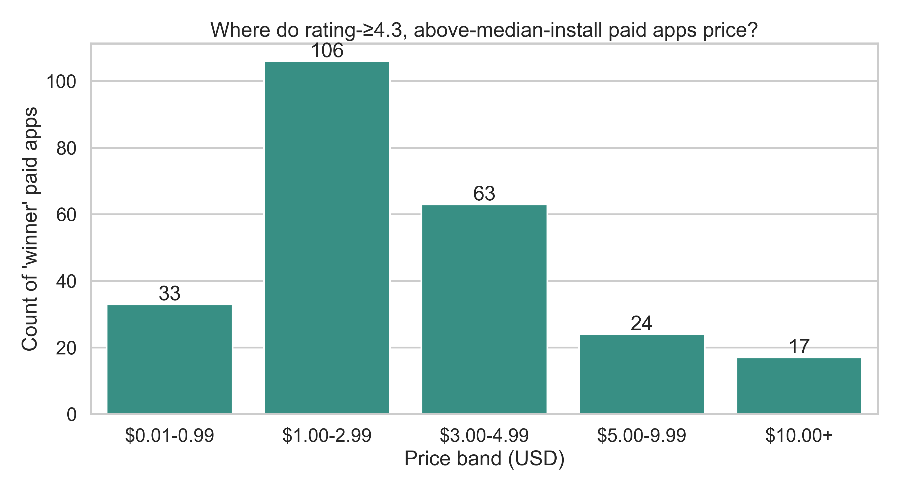
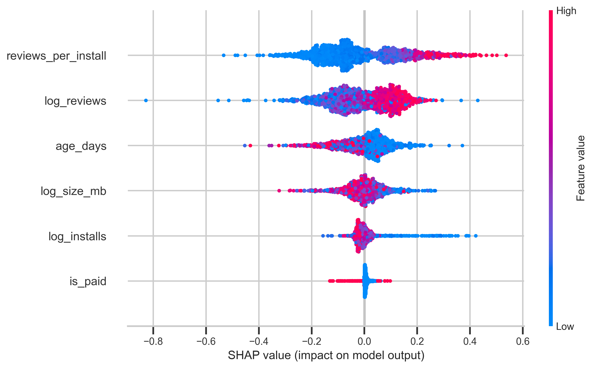

# Subscription App Intelligence

**Identifying pricing sweet spots, rating drivers, and growth opportunities across 9,659 mobile apps.**



> **Interactive Dashboard:** [`dashboard/index.html`](dashboard/index.html) (open in any browser)
> **Executive Summary:** [`reports/executive_summary.md`](reports/executive_summary.md)

---

## Executive Summary

- **70% of top-performing paid apps price between $1 and $4.99** — with a sweet spot median of **$2.99**.
- **Reviews-per-install is the #1 driver of ratings** — a more actionable lever for product teams than raw install volume.
- **Entertainment, Weather, and Finance rank as the top under-served categories** — stable across three weighting schemes (Kendall τ = 0.78).

## Business Problem

How can a consumer subscription-app operator or acquirer answer three commercial questions using only publicly available app-store data?

1. **Where should a new app price?**
2. **What product levers actually move user ratings?**
3. **Which categories are under-built and worth entering or acquiring into?**

## Key Insights

| # | Finding | Evidence |
|---|---|---|
| 1 | **$2.99 is the pricing sweet spot.** | 70% of rating-≥4.3, above-median-install paid apps fall in the $1–$5 band. Winner pool thins 7× above $9.99. |
| 2 | **Paid apps rate +0.11★ higher than free.** | OLS with category fixed effects, *p* < 0.0001, *n* = 7,027 (95% CI [+0.06, +0.17]). |
| 3 | **Reviews-per-install beats install count as a rating predictor.** | \|β\| = 0.209 in OLS; top feature in SHAP. Linear and tree-based models agree. |
| 4 | **"Waste time" is the universal complaint.** | Top negative bigram in 4 of 6 categories. "Stopped working" (Health), "fake profiles" (Dating) are category-specific. |
| 5 | **The top-5 category ranking is stable across weighting schemes.** | Kendall τ = 0.78 between default and growth-tilted scores. |





## Recommendations

**For an operator building a new app:**

1. **Price the paid tier at $1.99–$2.99** on launch. $0.99 under-captures value; $9.99+ sharply narrows the addressable install base.
2. **Invest in review-response and in-app feedback prompts before any performance-marketing spend.** Reviews-per-install is the single biggest ratings lever.
3. **Enter Entertainment or Weather if category is still open.** Both show high demand, a clear quality gap, and thin competition. Finance is the safer monetization bet.

**For an acquirer evaluating targets:**

1. **Start the deal funnel with the demand-side shortlist** in [`data/processed/acquisition_shortlist.csv`](data/processed/acquisition_shortlist.csv) — 20 apps filtered on rating, installs, reviews, and recency.
2. **Anchor bid framing to $1.99–$2.99 price points** — that is where the category's monetization is calibrated.
3. **Treat "stopped working" and "fake profiles" as deal risk**, not just product debt — both typically require 6–9 months to resolve.

Full walkthrough: [`reports/executive_summary.md`](reports/executive_summary.md)

## Business Impact

This analysis equips a consumer-app operator or acquirer to:

- Choose the pricing band that maximises the winner pool (revenue optimisation)
- Prioritise the one product lever that most moves user ratings (product analytics)
- Shortlist under-built categories for new-product entry (growth strategy)
- De-risk acquisition targets with a transparent, reproducible scoring framework (M&A diligence)

## Highlights

- **Analysed 9,659 Google Play apps and 37,427 user reviews** using Python and SQL.
- **Built a fixed-effects OLS + LightGBM / SHAP pipeline** to isolate rating drivers — linear and non-linear models agreed on the top three.
- **Shipped an NLP pain-point extractor** (VADER + TF-IDF bigrams) surfacing recurring user complaints across six categories — directly usable as product-roadmap input.
- **Authored eight production DuckDB SQL queries** covering window functions, CTE chains, pivots, and percentile aggregations.
- **Delivered a 3-page interactive Plotly dashboard** plus a Power BI build guide with DAX measures for business users.
- **Reproducible end-to-end:** pinned dependencies, 22/22 pytest suite green, `jupyter nbconvert --execute` validated on a clean clone.

## Interactive Dashboard

A 3-page Plotly HTML dashboard — interactive, runs in any browser, no install required:

| Page | Content |
|---|---|
| [Market Overview](dashboard/01_market_overview.html) | KPI cards, category distribution, rating histogram, free/paid split, sentiment by category |
| [Category Deep-Dive](dashboard/02_category_deepdive.html) | Rating × installs scatter, pricing-band bar, sentiment gauge, top-apps table |
| [Opportunity Finder](dashboard/03_opportunity_finder.html) | Hero quadrant chart, category opportunity ranking, acquisition shortlist |

Regenerate with `python dashboard/build_dashboard.py`.

> A Power BI version is also available — see [`dashboard/powerbi_build_guide.md`](dashboard/powerbi_build_guide.md) for the pre-aggregated model and DAX measures.

## Tech Stack

**Languages & data** · Python 3.12 · SQL (DuckDB) · parquet
**Analysis** · pandas · scikit-learn · statsmodels · LightGBM · SHAP
**NLP** · NLTK VADER · TF-IDF
**Visualisation** · Plotly · matplotlib · seaborn · Power BI
**Tooling** · Jupyter · pytest · nbconvert

**Skills demonstrated:** product analytics · revenue optimisation · data storytelling · stakeholder dashboarding · statistical modelling · NLP · SQL · forecasting-ready data pipelines

## Project Files

```
01_subscription_apps_intelligence/
├── notebooks/        Data prep → market landscape → rating drivers → opportunity scoring
├── src/              Reusable cleaning, stats, NLP, scoring modules (pytest covered)
├── tests/            22 / 22 passing
├── sql/              8 DuckDB queries over processed parquet
├── dashboard/        Interactive Plotly HTML + Power BI build guide
├── images/           7 publication-quality charts (300 DPI)
├── data/processed/   Clean parquet + CSVs (raw Kaggle CSVs gitignored)
└── reports/          Executive summary · methodology · CV bullets · interview Q&A
```

## Reproduce

```bash
python3.12 -m venv .venv && source .venv/bin/activate
pip install -r requirements.txt
# Place googleplaystore.csv + googleplaystore_user_reviews.csv in data/raw/
jupyter nbconvert --execute --to notebook --inplace notebooks/*.ipynb
python dashboard/build_dashboard.py
pytest tests/
```

## Methodology & Caveats

Full parsing choices, regression specification, NLP pipeline, and scoring sensitivity analysis: [`reports/methodology.md`](reports/methodology.md).

**Data caveats:** 2018 Google Play snapshot (Kaggle, CC0). `Installs` is bucketed (e.g. `100,000+`) and treated as ordinal. Review corpus covers ~11% of apps — NLP conclusions scoped to that sample. No revenue, DAU, or churn — the acquisition shortlist is a demand-side screen only.

## Author

**Mohammed Areeb Ali** — designed and built end-to-end: data cleaning, statistical modelling, NLP, SQL, interactive dashboarding, and business recommendations.

[github.com/Mohammedareebali](https://github.com/Mohammedareebali)
